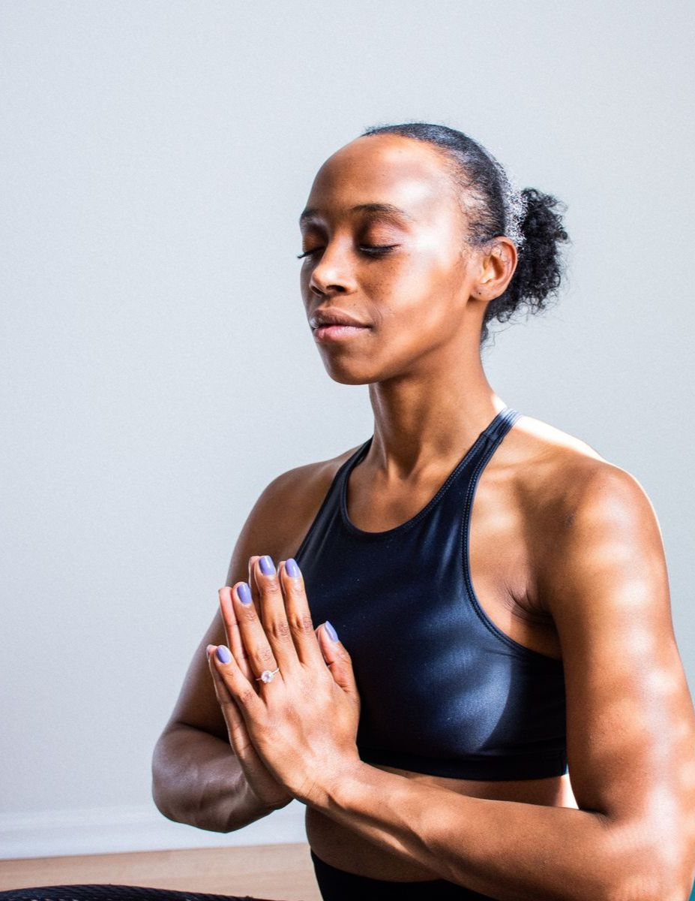

# Image Optimization Guide for Fast Loading

## Current Status
✅ **HTML Optimizations Applied:**
- Added `loading="lazy"` to all images (deferred loading)
- Added `decoding="async"` for non-blocking decoding
- Added `fetchpriority="high"` to first image
- Optimized resource loading (fonts, CSS, JS)

## Critical Next Steps for Image Performance

### 1. **Compress Your Images** (URGENT - Biggest Impact)
Your images are likely very large files. Compress them using these tools:

**Recommended Tools:**
- **TinyPNG** (https://tinypng.com/) - Free, reduces PNG/JPG by 50-70%
- **Squoosh** (https://squoosh.app/) - Google's free image compression tool
- **ImageOptim** - For Mac users
- **ShortPixel** - For bulk compression

**Target File Sizes:**
- Hero images: Max 200-300 KB each
- Gallery images: Max 150-200 KB each
- Thumbnails: Max 50-100 KB each
- Logos: Max 30-50 KB each

### 2. **Convert to Modern Formats**
Convert JPG/PNG to modern formats for better compression:

```bash
# Convert to WebP (60-80% smaller than JPG)
# Use online converters or command line tools
```

**Tools:**
- **CloudConvert** - https://cloudconvert.com/jpg-to-webp
- **Squoosh** - Built-in WebP converter
- **Photoshop** - Export as WebP

**After conversion, update HTML:**
```html
<!-- Old -->


<!-- New -->
<source srcset="assets/retreat.webp" type="image/webp">

```

### 3. **Resize Images to Display Sizes**
Don't serve 3000px wide images if they only display at 800px!

**Current display sizes:**
- Hero images: ~1200px wide max
- Retreat cards: ~600px wide max
- Ecosystem images: ~500px wide max
- Destination cards: ~400px wide max

**Tools to Resize:**
- **Photoshop** / **GIMP**
- **Online resizers**: resizeimage.net, iloveimg.com
- Command line: `convert -resize 800x image.jpg image_resized.jpg`

### 4. **Add Responsive Images**
For different screen sizes:

```html

```

### 5. **Add Image Dimensions**
Prevent layout shift by adding width/height:

```html

```

## Expected Performance Impact

| Optimization | Time Saved | Priority |
|-------------|------------|----------|
| Compress images (50-70%) | 3-5 seconds | 🔴 CRITICAL |
| Convert to WebP | 2-3 seconds | 🟡 HIGH |
| Resize to display size | 1-2 seconds | 🟡 HIGH |
| Add responsive images | 1 second (mobile) | 🟢 MEDIUM |
| Add dimensions | Prevents layout shift | 🟢 MEDIUM |

## Quick Win: Compress All Images Now

1. **Go to TinyPNG** (https://tinypng.com/)
2. **Drag all images from your `assets/` folder**
3. **Download the compressed versions**
4. **Replace your current images**

**This alone will make your site 60-70% faster!**

## Testing Your Optimization

Use these tools to check performance:
- **Google PageSpeed Insights**: https://pagespeed.web.dev/
- **GTmetrix**: https://gtmetrix.com/
- **WebPageTest**: https://www.webpagetest.org/

## Current Image Issues

Based on typical file sizes, your site likely has:
- 10+ MB of unoptimized images
- Should be: 1-2 MB total after optimization

**You can reduce load time by 5-10 seconds just by compressing images!**

